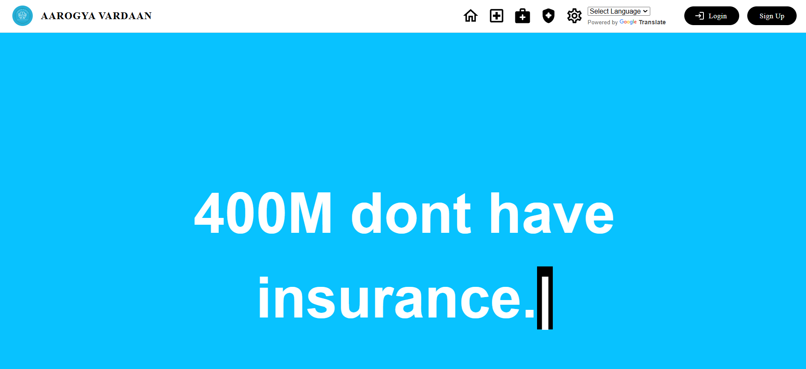
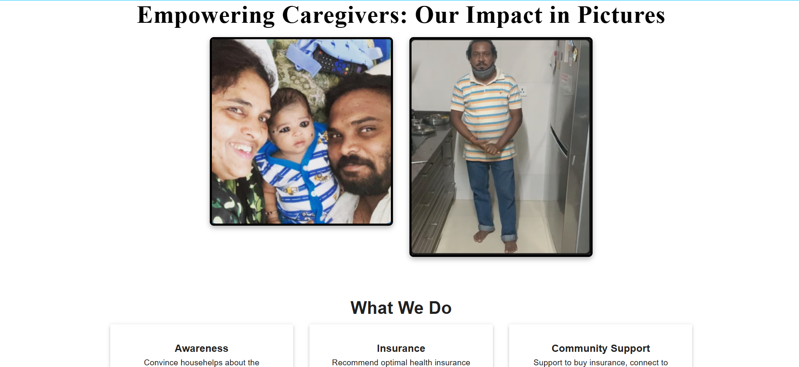
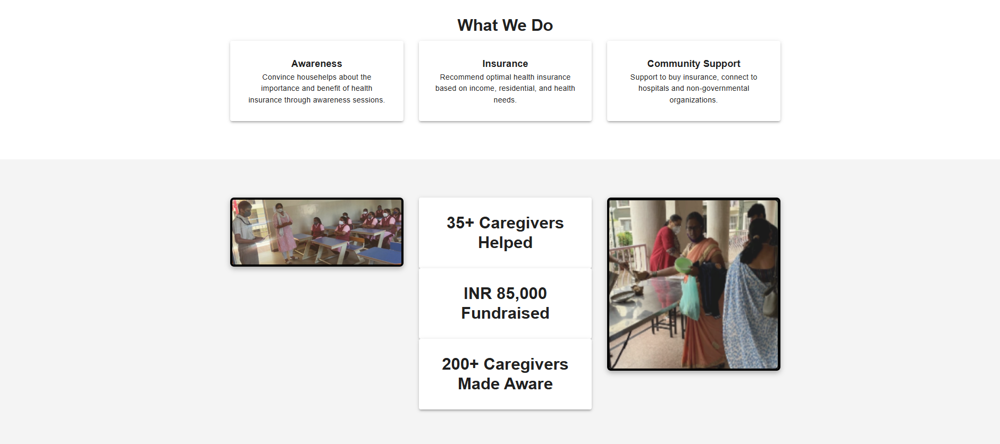
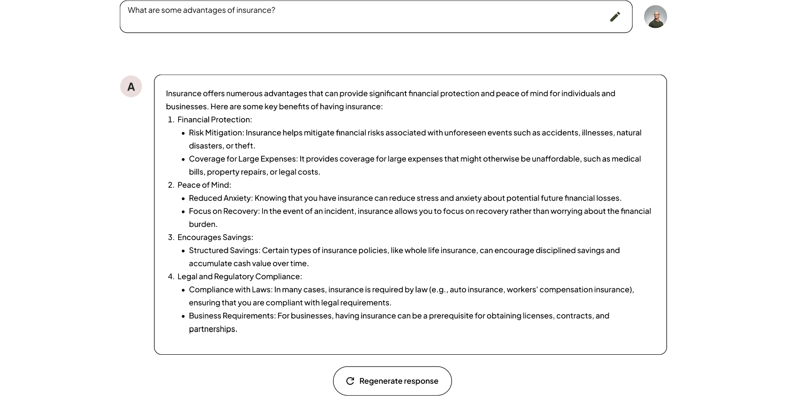
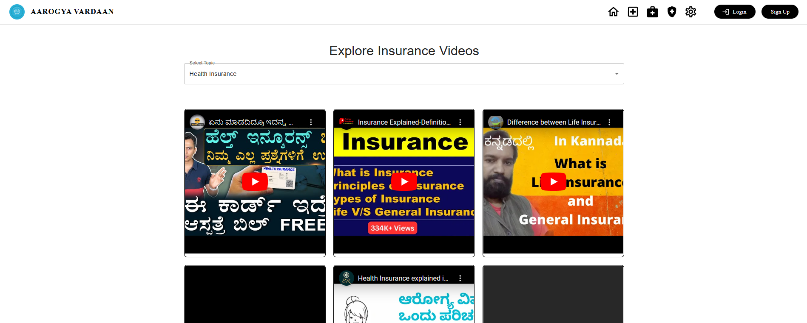

# Aarogya Vardaan - Insurance Recommendation Chatbot

## Description
**Aarogya Vardaan** is a multilingual web application designed to assist household helpers in Bangalore, India, in finding suitable health insurance plans and educating them about the importance and benefits of health insurance. 

The chatbot interacts with users in their preferred language, understands their needs, and recommends the best insurance options tailored to their requirements. This initiative aims to empower individuals with essential knowledge and access to health insurance.

---

## Features
- **Multilingual Support**: Communicate in multiple languages for better accessibility.
- **Personalized Insurance Recommendations**: Recommends plans based on individual needs and preferences.
- **Educational Content**: Provides insights into the importance, benefits, and process of obtaining health insurance.
- **User-Friendly Web App**: Simple and intuitive interface designed for ease of use.

---

## Tech Stack
- **Frontend**: ReactJS
- **Backend**: Django
- **API**: OpenAI API
- **Machine Learning**: Insurance recommendation model for personalized suggestions

---

## Installation and Setup

1. Clone the repository:
   ```bash
   git clone https://github.com/your-username/Aarogya-Vardaan.git
   ```
2. Navigate to the project directory:
   ```bash
   cd Aarogya-Vardaan
   ```
3. Install dependencies for the frontend:
   ```bash
   cd frontend
   npm install
   ```
4. Install dependencies for the backend:
   ```bash
   cd ../backend
   pip install -r requirements.txt
   ```
5. Set up the OpenAI API key in the `.env` file in the backend folder:
   ```plaintext
   OPENAI_API_KEY=your_api_key
   ```
6. Start the services:
   - Frontend:
     ```bash
     cd frontend
     npm start
     ```
   - Backend:
     ```bash
     cd ../backend
     python manage.py runserver
     ```

---

## Screenshots



*The home page of Aarogya Vardaan*


*Chatbot interaction for insurance recommendations*


*Chatbot Page*


*Insurance educational section*

---

## Contributing
Contributions are welcome! If you have ideas to enhance the project or want to fix issues, feel free to open a pull request.

---

## License
This project is licensed under the MIT License. See the `LICENSE` file for more details.
